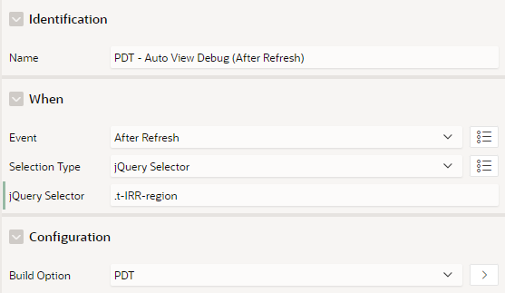

# Pretius Developer Tool

Pretius Developer Tool (PDT) is an Oracle APEX plugin developed by [Matt Mulvaney](URL "https://www.twitter.com/Matt_Mulvaney") at [Pretius](URL "https://www.pretius.com"). Unlike other APEX plugins, it was made not with users in mind but for the benefit of developers. It provides you with a few useful features:
* Revealer: Displays client and session info that is not immediately available to you as a developer
* Reload Frame: Provides you with a convenient single click for reloading a modal dialog page
* Visual Build Options: Glows page components in blue/red, giving you a visual clue on whether a certain component will be included/excluded on export
* Developer Bar Enhancements
   * Quick Page Designer Access: Use a keyboard shortcut to quickly navigate to any Application & Page in your workspace
   * Glows the Debug Icon red when Debug is on
   * Auto View Debug for Page Load and Page Accept
   * Master Detail Debug all on the same page
   * Shared Components icon appears on the Developer Bar (replacing the Home button)

Pretius Developer Tool is built all modular so you can expect more features to come in the future.

 

# Release History

24.1.3 : October 2024
* Added Feature: Old School Debug
* Added Feature: Home Button is replaced by a Shortcut Menu

24.1.2 : September 2024
* Added Feature: Auto View Debug
* Added Feature: Master Detail Debug
* Added APEX$SESSION & NLS to Revealer

24.1.1 : June 2024
* Added support for APEX 24.1 Select One & Select Many
* Fixed crash on UC RTE Item Issue [#1](https://github.com/Pretius/pretius-developer-tool/issues/1)
* Improved Revealer item support for multiple Item Types
* Improved Revealer moved all associated elements to "Others"

23.2.2 : June 2024
* Added Feature: Debug Component Linkage (See section below)
* Added Debug Keyboard Shortcut i.e ctrl+alt/option+D
* Added support for Dark Mode Theme Styles 
* Improved Revealer > Debug. Aligned it closer to APEX debug.
* Improved Debug Performance
* Improved Build Option Highlight Performance
* Fixed Page Load Dynamic Actions not logging to Debug when Build Option Highlight feature is active
* Improved configuration check / removed assumption that Global Page is always page 0

23.2.1 : April 2024
* Fixed Revealer empty fix for APEX 23.2 
* Fixed Shared Components link fix for APEX 23.2
* Fixed Quick Page Designer Access, Not Found fix for APEX 23.2
* Reworked Debug Glow due to poor contrast / accessibility

22.2.3 : April 2023
* Added Quick Page Designer Access
* Added Debug Icon Glow
* Added feature to turn all features on at once
* Added Shared Components to the Developer Bar (replaces Home button)
* Added Mac friendly keyboard shortcuts
* Fixed super-sized search box in Revealer when using Redwood Light Theme Style
* Fixed identification for Build Options placed at Dynamic Action level
* Fixed Revealer Icon disappearing when using different icon packs to Font APEX
* Internally redesigned 

21.2.5 : January 2022
* Initial Version

# Plugin Installation Quick-Start

Minimum Version of APEX Required: **23.2.0**

Note: Debug features are disabled on apex.oracle.com due to performance issues.

Import the plugin into your application from this location:

`plugin\dynamic_action_plugin_com_pretius_apex_devtool.24.1.2.sql`

After installation, follow these steps:
1. Create a Page Load Dynamic Action on Page **0** Called **Pretius Developer Tool**
2. Assign the Dynamic Action a <a href="https://www.youtube.com/watch?v=XOLCrHSRRrM&t=84s" target="_blank">Build Option</a> that is set to Exclude on Export
3. Select "Pretius Developer Tool" APEX Plugin as the true action

 

# Features
* Revealer
   * Debug Component Linkage (See Debug Component Linkage section below)
* Modal Reload
* Visual Build Options
* Developer Bar Enhancements 
   * Quick Page Designer Access
   * Glow Debug Icon
   * Auto View Debug
   * Master Detail Debug
   * Shared Components Button

 Supports Firefox, Internet Explorer, Edge & Chrome

# Settings
* Use the Settings (Filter icon) in the toolbar to enable/disable features
* Settings are stored at Browser Level, i.e, your settings are preserved for multiple APEX applications (providing you use the same browser)

# Opting Out
* If you no longer wish to use Pretius Development Tool, however, other Developers on your Application wish to continue using it, you can opt out by following the link at the top of the options page
* If you wish to opt back in, type the following in the Console window of your browser

   <code>pdt.optIn();</code>

# Quick Page Designer Access tips
* Enter a Page Number or Name to locate the page
* To list all pages...
   * Enter the / (forward-slash) symbol in the search box
   * Enter the text 'page' in the search box
* Enter in the format APP_ID.PAGE_ID (e.g 100.9999) to immediately locate the page
* To open Page Builder in a new tab, hold down the Ctrl key (Windows) or the Command key (Mac) and click on any page in the search results. Tip: you can also do this on the Shared Components Button

# Debug Component Linkage
To access use Revealer > Debug and review the Component column associated with Ajax Plugins.

Note this only works for:
  1. The supports list of components (see below) 
  2. Ajax Plugins that have ran within in current session only

* Supported: 
   * Dynamic Actions: Execute Server-Side Code
   * Charts
   * Reports: IR, CR, Column Toggle Report, Reflow Report
   * Searching: Facets, Search Region, Smart Filters
   * Calendar
   * Region Display Selector
   * Items: Combobox, Select, Radio, Checkbox Group, QR Code, Shuttle, Text with Autocomplete
* Partial Support:
   * Dynamic Action Plugins
      * Requires the plugin developer to set the [apex_plugin.t_dynamic_action_render_result.ajax_identifier attribute](https://docs.oracle.com/en/database/oracle/apex/23.2/aeapi/APEX_PLUGIN-Data-Types.html#GUID-515CCE82-E815-4B04-B193-6195A722FA91) e.g [Pretius Smart Checkbox Column](https://github.com/Pretius/pretius-smart-checkbox-column/blob/691b6f7dbd9d405aa37e2500bf4b7b2d8e894bda/src/pretius_smart_checkbox_column.sql?plain=138#L138)
   * Region Plugins
      * Uses a catch-all, on a best endeavours apporach
* Not Supported (Due to inconsistencies in how these operate in the APEX debug when comparing to the list above): 
   * Reports: IG, Cards
   * Items: List Manager
   * Regions: Dynamic Content Regions, Template Components 

# Auto View Debug
With Debug Enabled, this automatically opens View Debug on the following events:
* Page Load (Show)
* On Error Message (Accept) <code>apex.message.setThemeHooks</code>
* Custom Events - For example to View Debug after Report Refresh
  * Add a Page Zero Dynamic Action - with PDT Build Option

  
  
  * Execute JavaScript Code
  <pre>pdt.pretiusContentDevBar.openAutoViewDebug();</pre>

# Future developments
* Roadmap
   * Enhance Reaveler to support newer page elements
* Please let me know any of your wishes

# Advanced Installation

## Web Server Installation (Optional)
1. Place the JavaScript & CSS files from plugin\server on your web server.

2. Create an Application Substitution (Recommended), Application Item or Global Page Item with the following properties:
   * Name: <code>APP_PRETIUS_DEVTOOL_PREFIX</code>
   * Value: URL e.g., <code>http://127.0.0.1:8889/</code> or <code>#IMAGE_PREFIX#</code>

   *Don't forget the final slash (/) on the end of the URL*

## DB Installation (Optional)
1. Compile the **pkg_com_pretius_apex_devtool** package spec & body from plugin\db

2. Create an Application Substitution (Recommended), Application Item or Global Page Item as:
   * Name: <code>APP_PRETIUS_DEVTOOL_PKG</code>
   * Value: <code>pkg_com_pretius_apex_devtool.</code>

   *Don't forget the final dot (.) on the end of the value*