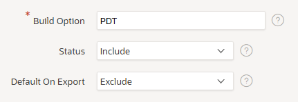
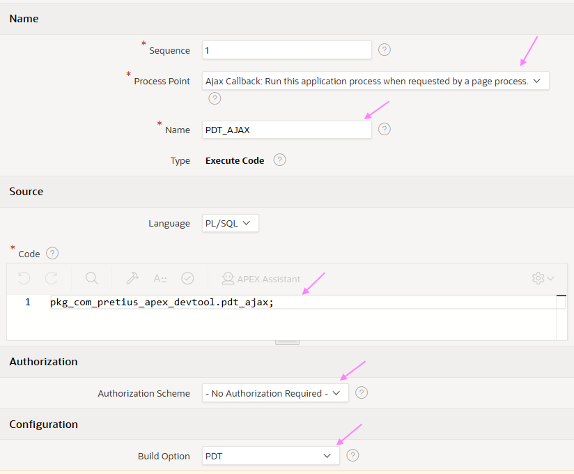
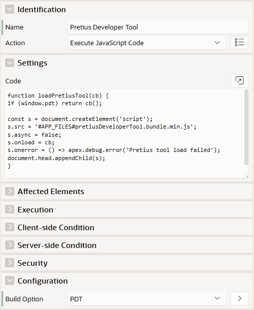

# PDT Installation (No Plugin Version)

Follow these steps to install Pretius Developer Tool without the plugin.

## 1) Compile database package

Compile the package spec and body:

- `pkg_com_pretius_apex_devtool_spec.sql`
- `pkg_com_pretius_apex_devtool_body.sql`

From: `plugin/db`

## 2) Create a Build Option

Create a Build Option with:

- **Name**: `PDT`
- **Status**: `Include`
- **Default On Export**: `Exclude`

  

## 3) Create an Application Process

Create an Application Process with:

- **Name**: `PDT_AJAX`
- **Point**: `Ajax Callback`
- **PL/SQL**: 
    ```
    pkg_com_pretius_apex_devtool.pdt_ajax;
    ```
- **Authorization Scheme**: `No Authorization Scheme`
- **Build Option**: `PDT`

  

## 4) Select a bundle zip and upload to Static Application Files

Use this guide to choose a bundle:

| Name | Pros | Cons |
|------|------|------|
| `pdt-bundle.zip` | All features | Adds ~9 static files |
| `pdt-bundle-lite.zip` | Only 2 static files | No Master-Detail Debug feature |

Go to **Static Application Files** > **Create File** and upload **one** of:

- `server-dist/pdt-bundle.zip`
- `server-dist/pdt-bundle-lite.zip`


## 5) Create a Dynamic Action on Page 0

Go to **Page 0** > **Dynamic Actions** > **Page Load** and create:

- **Name**: `Pretius Developer Tool`
- **Action**: `Execute JavaScript Code`
- **Build Option**: `PDT`
- **Code**:

    ```javascript
    function loadPretiusTool(cb) {
    if (window.pdt) return cb();

    const s = document.createElement('script');
    s.src = '#APP_FILES#pretiusDeveloperTool.bundle.min.js';
    s.async = false;
    s.onload = cb;
    s.onerror = () => apex.debug.error('Pretius tool load failed');
    document.head.appendChild(s);
    }

    loadPretiusTool(() => pdt.renderBundle());
    ```

    
